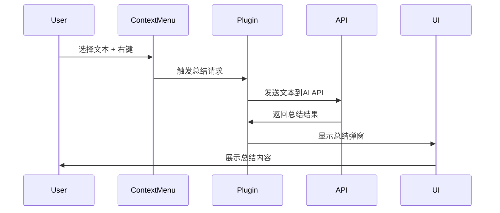

# 文本总结插件 (Text Summary Plugin)

这个插件为 Chrome 扩展提供了智能文本总结功能，用户可以通过右键菜单对选中的文本进行 AI 总结。

## 🚀 功能特性

- **右键菜单集成**：在网页上选择文本后，右键点击即可看到"📝 AI 总结选中文本"选项
- **智能总结**：调用 AI API 对选中文本进行智能总结
- **备用方案**：当 API 不可用时，提供本地简单总结功能
- **历史记录**：自动保存总结历史，方便回顾
- **错误处理**：完善的错误处理和用户提示
- **响应式界面**：美观的总结结果展示弹窗

## 📁 文件结构

```
src/plugins/text-summary/
├── text-summary.plugin.ts        # 插件主文件
├── context-menu-manager.ts       # 右键菜单管理器
├── features/
│   └── text-summary.feature.ts   # 文本总结功能实现
├── usage-example.ts              # 使用示例
└── README.md                     # 说明文档
```

### 职责分离

- Feature：只关心算法，不管界面
- Content Script：只管界面显示，不管算法
- Background：只管消息传递，不管具体实现
- Context Menu：只管菜单，不管其他

## 🔧 配置说明

### 插件配置

```typescript
const config = {
  enabled: true,
  settings: {
    apiUrl: "https://your-ai-api.com/summarize", // AI API端点
    apiKey: "your-api-key-here", // API密钥（可选）
    maxLength: 200, // 总结最大长度
    language: "zh-CN", // 目标语言
  },
};
```

### API 要求

插件需要调用的 AI API 应该支持以下格式：

**请求格式：**

```http
POST /summarize
Content-Type: application/json
Authorization: Bearer your-api-key

{
  "text": "要总结的文本内容...",
  "max_length": 200,
  "language": "zh-CN",
  "timestamp": 1234567890
}
```

**响应格式：**

```json
{
  "success": true,
  "summary": "这是AI生成的总结内容...",
  "error": null
}
```

## 💻 使用方法

### 1. 插件初始化

```typescript
import { PluginManager } from "../../core/plugin-manager";
import textSummaryPlugin from "./text-summary.plugin";

// 初始化插件管理器
const pluginManager = new PluginManager();
await pluginManager.initialize();

// 加载文本总结插件
await pluginManager.loadPlugin(textSummaryPlugin);
```

### 2. 配置插件

```typescript
await textSummaryPlugin.setConfig({
  settings: {
    apiUrl: "https://your-ai-api.com/summarize",
    apiKey: "your-api-key-here",
    maxLength: 150,
    language: "zh-CN",
  },
});
```

### 3. 用户操作

1. 在任意网页上选择要总结的文本
2. 右键点击选中的文本
3. 选择 "📝 AI 总结选中文本" 菜单项
4. 等待总结结果在弹窗中显示

## 🔄 插件生命周期

1. **初始化 (initialize)**：加载配置，创建右键菜单管理器
2. **激活 (activate)**：注册右键菜单，监听用户操作
3. **执行 (execute)**：处理总结请求，调用 API，显示结果
4. **停用 (deactivate)**：注销右键菜单
5. **销毁 (dispose)**：清理所有资源

## 🎯 工作流程



## 🛠️ 扩展功能

插件设计为可扩展的，可以轻松添加以下功能：

- **多种 AI 模型**：支持不同的 AI 服务提供商
- **总结模板**：预设不同的总结风格（简洁/详细/要点）
- **快捷键**：键盘快捷键支持
- **批量总结**：同时总结多个文本片段
- **导出功能**：将总结导出到笔记应用
- **语音播放**：朗读总结内容

## 🚨 错误处理

插件包含完善的错误处理机制：

- **API 调用失败**：自动使用本地备用总结方案
- **网络错误**：显示友好的错误提示
- **文本过短**：自动检测并提示用户
- **配置错误**：验证配置参数有效性

## 📊 性能考虑

- **异步处理**：所有 API 调用都是异步的，不会阻塞 UI
- **缓存机制**：可以添加总结结果缓存
- **请求限制**：防止频繁调用 API
- **资源清理**：及时清理 DOM 元素和事件监听器

## 🔐 安全性

- **API 密钥保护**：敏感信息存储在 chrome.storage 中
- **HTTPS 要求**：确保 API 调用使用安全连接
- **输入验证**：验证用户输入的文本内容
- **权限控制**：只在必要时请求权限

## 🧪 测试建议

1. **单元测试**：测试各个功能模块
2. **集成测试**：测试插件与主系统的集成
3. **UI 测试**：测试用户界面的响应性
4. **API 测试**：测试各种 API 响应情况
5. **错误测试**：测试各种错误场景的处理

## 📝 更新日志

### v1.0.0

- 初始版本发布
- 基础文本总结功能
- 右键菜单集成
- 错误处理和备用方案
- 总结历史保存
